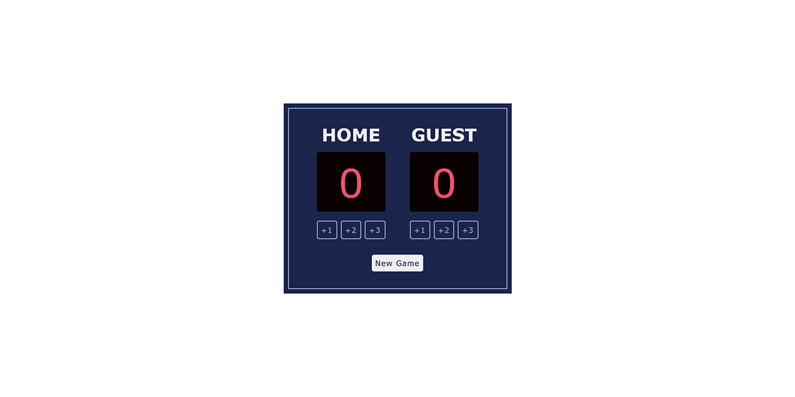

# Score Tracking App

 

## Table of contents

- [Overview](#overview)
  - [Description](#description)
  - [Links](#links)
- [My Process](#my-process)
  - [Built with](#built-with)
  - [What I learned](#what-i-learned) 
  - [Acknowledgements and Resources](#acknowledgements0-and-resources) 
- [Author](#author)

## Overview

### Description
A straightforward web application designed for keeping track of scores. Points can be added for each team with the score being updated in real-time. Starting a new game automatically resets team scores back to 0.

### Links

- [Live Demo](https://your-live-site-url.com)

## My Process

### Built with

- Flexbox
- CSS Grid
- Vanilla JS

### What I learned

- During this project, I gained experience in working with the dataset attribute in JavaScript to access custom data attributes of HTML elements. This allowed me to efficiently retrieve and use data associated with the score-keeping buttons.
- I also encountered and resolved an issue related to absolute positioning. It took an embarrassing amount of time to figure out that the issue was my CSS and not my JS - very frustrating. By adjusting the z-index of elements, I fixed an overlapping issue that was preventing user interaction with the buttons. Thank you Stack Overflow!

### Acknowledgements and Resources

- [Scrimba - Learn JavaScript](https://scrimba.com/learn/learnjavascript) - This project was a challenge from the Learn JavaScript course on Scrimba to test JavaScript knowledge.

## Author

- Jesse Adkins, Junior Frontend Developer
- Email: jesse@jesseadkins.com
- [Portfolio](https://www.jesseadkins.com)
- [LinkedIn](www.linkedin.com/in/adkinsjesse)
- [Frontend Mentor](https://www.frontendmentor.io/profile/jessadk)

